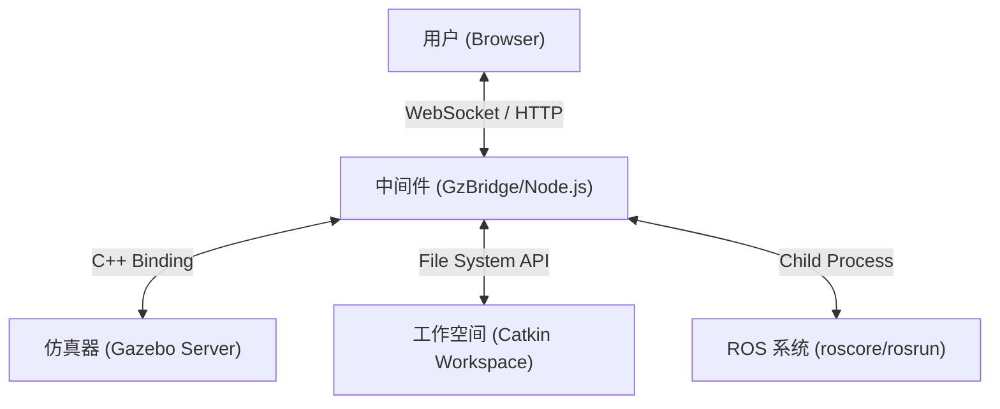

# Gzweb - 增强版 Web IDE

本项目是 **Gzweb** 的定制修改版，旨在打造一个**基于 Web 的 ROS/Gazebo 一体化开发环境**。与原版 Gzweb 仅关注可视化不同，本版本集成了强大的后端能力，支持在线代码编辑、ROS 包管理以及仿真控制。

## 🏗 项目架构

系统采用典型的 B/S (浏览器/服务器) 架构，设计运行在具备 ROS 环境的工作站上（例如 Docker 容器或本地机器）。



### 核心组件

1.  **服务端 (Gzbridge)**

    - **技术栈**: Node.js + C++ Addons (NAN/Node-gyp)。
    - **功能**: 作为中间件，负责托管 Web 服务器，管理 WebSocket 连接，并将 JavaScript 调用桥接到 Gazebo 的 C++ API。
    - **增强点**:
      - **API 扩展**: 增加了用于文件操作、进程管理和 ROS 交互的自定义 REST API。
      - **Catkin 集成**: 可直接访问 `/home/ubuntu20/catkin_ws`，支持构建和源码管理。

2.  **客户端 (Gz3d)**

    - **技术栈**: WebGL (Three.js), jQuery Mobile, Angular。
    - **功能**: 渲染 3D 场景并提供用户交互界面。
    - **增强点**: 增加了与后端 IDE 新特性交互的 UI 元素和逻辑。

3.  **ROS/Gazebo 环境**
    - 后端依赖标准的 ROS 安装。它能够动态生成 ROS 节点、加载世界文件和编译功能包。

## ✨ 核心功能

专为远程开发定制的几个关键特性：

- **Web 代码编辑器**: 通过 `/code_editor` 接口，直接在浏览器中读取和编辑 `catkin_ws` 中的源码。
- **功能包管理**:
  - **上传**: 支持上传 `.zip` 或 `.tar.gz` 格式的 ROS 包。
  - **解压**: 自动解压到 `src` 目录。
  - **编译**: 远程触发 `catkin_make` 并实时回显构建日志。
- **仿真控制**:
  - **场景加载**: 动态切换 Gazebo 仿真世界 (`/load_world`)。
  - **ROS 运行**: 通过 Web 界面执行 `rosrun <package> <node>` 命令。
  - **日志**: 查看和清理 ROS 标准输出日志。

## 🚀 安装与使用

### 前置要求

- Ubuntu (测试环境 20.04)
- ROS Noetic (或兼容版本)
- Gazebo (推荐 version 11)
- Node.js & npm
- Libjansson-dev (`sudo apt-get install libjansson-dev`)
- Mercurial (`sudo apt-get install mercurial`) - 部分 Gzweb 初始设置需要

### 构建

1.  **安装依赖**

    ```bash
    npm install
    ```

2.  **构建 Gzweb 及 C++ 绑定**
    ```bash
    npm run update
    # 或者全新构建:
    # ./node_modules/.bin/grunt build
    ```

### 运行

启动服务器（默认端口 8080）：

```bash
npm start
```

- 服务器监听地址: `0.0.0.0:8080`。
- 浏览器访问: `http://localhost:8080`。

指定端口启动：

```bash
npm start --port=9090
```

## 📚 API 接口说明 (内部开发用)

| 接口端点        | 方法    | 描述                                                    |
| :-------------- | :------ | :------------------------------------------------------ |
| `/code_editor`  | POST    | 在项目根目录下加载或保存文件。                          |
| `/node_manager` | POST    | 处理 `extract` (解压) 和 `compile` (编译) 动作。        |
| `/rosrun`       | POST    | 执行 ROS 节点: `{ "package": "pkg", "file": "node" }`。 |
| `/rosstop`      | GET     | 停止当前运行的 ROS 节点。                               |
| `/load_world`   | POST    | 加载指定的 `.sdf` 或 `.world` 文件。                    |
| `/roslogs`      | GET/DEL | 获取或清理 ROS 标准输出日志。                           |

---

_Gzweb 原版说明:_

### 安装教程

请参考教程 [这里](http://gazebosim.org/tutorials?tut=gzweb_install&cat=gzweb)

### 开发教程

请参考教程 [这里](http://gazebosim.org/tutorials?tut=gzweb_development&cat=gzweb)

[](https://codecov.io/bb/osrf/gzweb)
